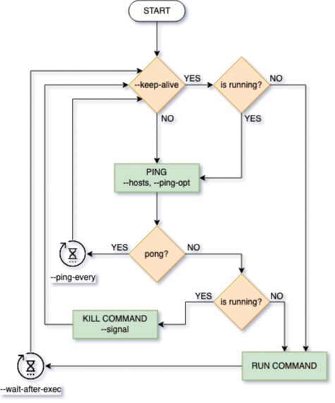

# pingkeeper

[](https://travis-ci.org/ignlg/pingkeeper)

Launch a network-related command and monitor network with ping. On network failure, kill and run it again. Optionally monitor that the command is permanently running.

## Flow chart



## Installation

Download release binary from [releases page](https://github.com/ignlg/pingkeeper/releases).

## Usage

```
USAGE:
    pingkeeper [FLAGS] [OPTIONS] <COMMAND>

FLAGS:
    -h, --help
            Prints help information

    -k, --keep-alive
            Run command on start and restart it if command dies

    -q, --quiet
            Do not output anything from command output, also reduces -v by 1

    -V, --version
            Prints version information

    -v
            Verbose


OPTIONS:
        --hosts <hosts>
            Hosts to ping, order is ignored [default: 8.8.8.8 8.8.6.6 1.1.1.1 1.0.0.1]

    -m, --max-errors <max-errors>
            Maximum number of command errors in a row, 0 for infinite [default: 0]

        --ping-every <n>
            Check ping again after this amount of seconds from the latest success [default: 5]

        --ping-opt <opts>
            Options for ping command [default: -c1]

        --wait-after-exec <seconds>
            Seconds to check ping after executing command [default: 5]

    -s, --signal <signal>
            Signal to end command on command restart: `SIGINT`, `SIGTERM`, etc [default: SIGINT]


ARGS:
    <COMMAND>
            Command to run
```

## Changelog

### v3.0.0

- [ ] detect network connection directly.
- [ ] opt `-t --timeout`, seconds waiting for network connection.
- [ ] use ping as fallback.
- [x] opt `--max-errors`, number of keep-alive errors allowed in a row to keep running.

### v2.0.0

- [x] rename opt ~~`--boot-time`~~ -> `--wait-after-exec`.
- [x] reanme opt ~~`--check-time`~~ -> `--ping-every`.
- [x] opt `--signal`; default: `"SIGINT"`.
- [x] flow chart.
- [x] move logic to subfiles.
- [x] tests.

### v1.0.0

- [x] launch command when ping fails.
- [x] opt `--hosts`; default: `"8.8.8.8 8.8.6.6 1.1.1.1 1.0.0.1"`.
- [x] detect if network is reachable.
- [x] opt `--ping-opt`, ping options; default: `"-c1"`.
- [x] opt `--boot-time`, seconds wait to check network after command; default: `5`.
- [x] opt `--check-time`, network check delay in seconds; default: `5`.
- [x] restart (send SIGINT signal) on network error.
- [x] opt `--keep-alive`, run command on init and restart on command exit.
- [x] opt `-v --verbose`, show log.
- [x] opt `-q --quiet`, hide stdout/stderr from subcommand.

## Backlog

- [ ] opt `--kill-cmd`, custom kill command.
- [ ] opt `--check-cmd`, custom check network command.

- [ ] pingkeeper tests with mocks.
- [ ] website.
- [ ] LaunchDaemon generator.
- [ ] macOS notifications: connection lost, connection recovered.
- [ ] opt `--disable-notifications`.

- [ ] detect SIGTERM on subprocess and stop.
- [ ] write pid to proc.
- [ ] opt `-f --force` to kill pid and remove pid from proc.
- [ ] check if interface is up.
- [ ] write logs to `/var/log`.

## Build

Build with

```
cargo build --release
```

You will find your executable at `./target/release/pingkeeper`.

## License

Pingkeeper
Copyright (C) 2020 Ignacio Lago

This program is free software: you can redistribute it and/or modify
it under the terms of the GNU General Public License as published by
the Free Software Foundation, either version 3 of the License, or
(at your option) any later version.

This program is distributed in the hope that it will be useful,
but WITHOUT ANY WARRANTY; without even the implied warranty of
MERCHANTABILITY or FITNESS FOR A PARTICULAR PURPOSE. See the
GNU General Public License for more details.

You should have received a copy of the GNU General Public License
along with this program. If not, see <https://www.gnu.org/licenses/>.
